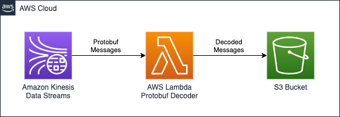
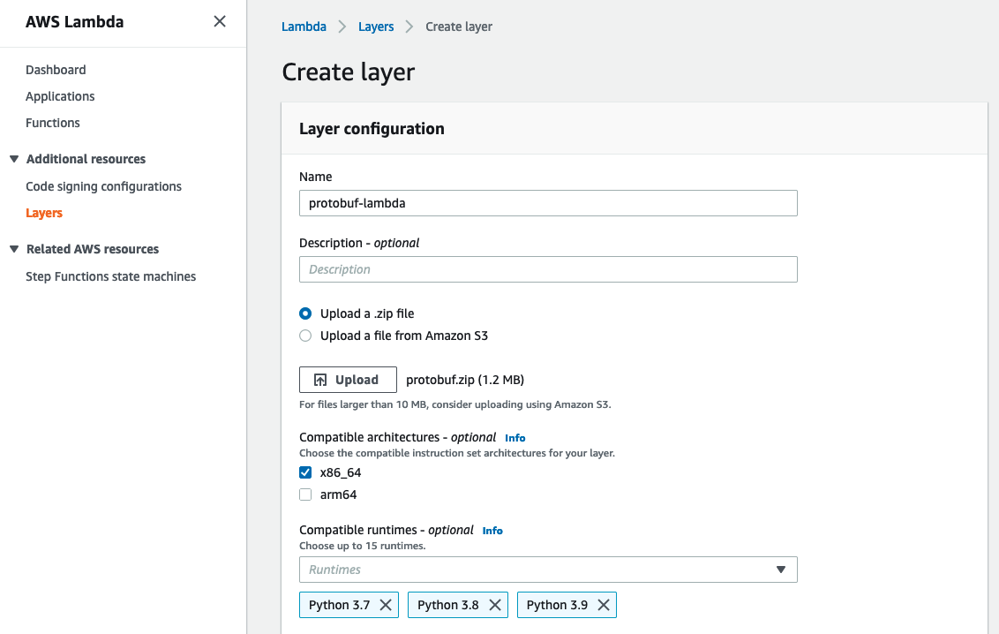
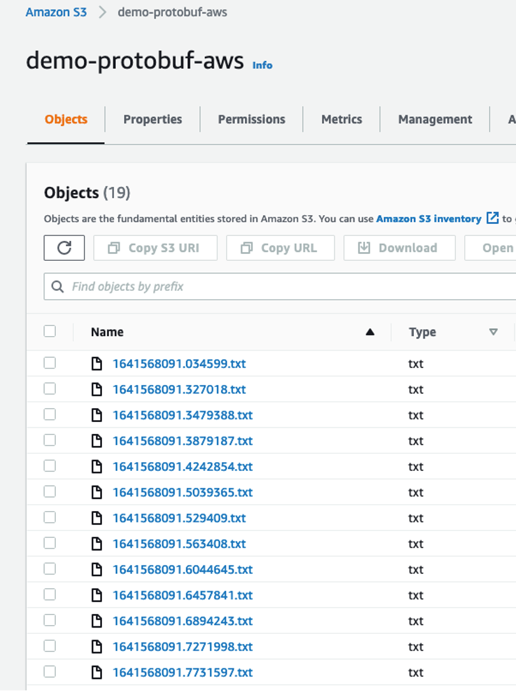
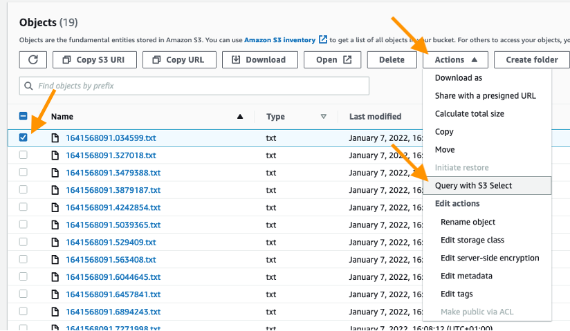
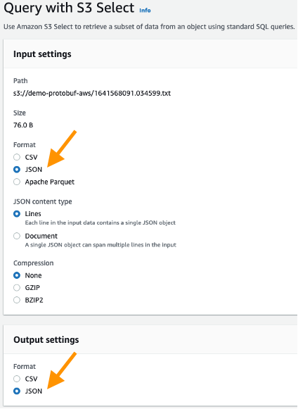
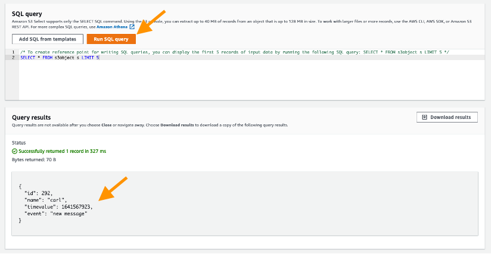

# Decoding protobuf messages using AWS Lambda

## Overview

 

This project contains source code and supporting files for a serverless application that you can deploy with the SAM CLI. It includes the following files and folders.

- functions - Code for the application's Lambda function, which is a Kinesis Stream decoding function, to decode the protobuf records before writing them to S3
- template.yaml - A template that defines the application's AWS resources.

This application capture events encoded in protobuf coming from a Kinesis stream, it decodes and stores them in an S3 Bucket.


The application uses several AWS resources, including an S3 Bucket, Lambda functions, and a Kinesis stream.  These resources are defined in the `template.yaml` file in this project. You can update the template to add AWS resources through the same deployment process that updates your application code.

## Pre-requisites for deploying this application
* [Protobuf Lambda Layer](#Protobuf-Lambda-Layer)
* [AWS CLI](https://docs.aws.amazon.com/cli/latest/userguide/getting-started-install.html)
* [Python 3.9](https://www.python.org/downloads/)
* [SAM CLI](https://docs.aws.amazon.com/serverless-application-model/latest/developerguide/serverless-sam-cli-install.html)


### Protobuf Lambda Layer
The first pre-requisite is to build the AWS Lambda Layer containing the protobuf libraries that are required for the decoding.  
You can use any development environment where you can install Python 3.x and pip to create the Lambda layers.  

First generate the python source code required for the protobuf encoding and decoding, starting from the proto definition file.  
This code can be generated using the protobuf compiler having with the proto definition file as input

Create the proto definition file:
```bash
cat > /home/ec2-user/environment/demo.proto << ENDOFFILE
syntax = "proto3";
message demo {
  optional int32 id = 1;
  optional string name = 2;
  optional int32 timevalue = 3;
  optional string event = 4;
}
ENDOFFILE 
``` 
&nbsp;
&nbsp;

Now compile this file with the protobuf compiler (protoc), to generate the python source code required for the protobuf encoding/decoding.  
Note that the generated code will work only for the classes defined in the proto definition file:
```bash
wget 
https://github.com/protocolbuffers/protobuf/releases/download/v3.19.1/protoc-3.19.1-linux-x86_64.zip

unzip protoc-3.19.1-linux-x86_64.zip

mkdir /home/ec2-user/environment/output

/home/ec2-user/environment/bin/protoc -I=/home/ec2-user/environment/ --python_out=/home/ec2-user/environment/output demo.proto
```
&nbsp;
&nbsp;

Create a new directory named protobuf and install locally the protobuf libraries:
```bash
mkdir -p ~/environment/output/protobuf
cd ~/environment/output/protobuf
mkdir python
cd python
pip3 install protobuf --target .
```
&nbsp;
&nbsp;

Now you have to include the python source code to the libraries installed locally:
```bash
mkdir custom
cd custom
cp ~/environment/output/demo_pb2.py .
echo 'custom' >> ~/environment/output/protobuf/python/protobuf-3.19.1.dist-info/namespace_packages.txt
echo 'custom/demo_pb2.py' >> ~/environment/output/protobuf/python/protobuf-3.19.1.dist-info/RECORD
echo 'custom' >> ~/environment/output/protobuf/python/protobuf-3.19.1.dist-info/top_level.txt
```
&nbsp;
&nbsp;

Now you have to zip the python folder:
```bash
cd ~/environment/output/protobuf
zip -r protobuf.zip .
```

Finally, your Lambda layer is ready, if you built it in a remote instance you have to copy it in your local machine.
&nbsp;
&nbsp;

Now you are going to add the layer created in the previous steps to Lambda.
From the AWS Console select the Lambda service and select Create a Layer:
 

&nbsp;
&nbsp;

Name it protobuf-lambda and upload the protobuf.zip that you created in the previous step.

Once the upload is complete select x86_64 compatible architectures and select the corresponding python runtime versions.


## Deploy this application

The Serverless Application Model Command Line Interface (SAM CLI) is an extension of the AWS CLI that adds functionality for building and testing Lambda applications.


Build the application running the below command in your shell:

```bash
sam build 
```

The second command will package and deploy your application to AWS, with a series of prompts:

To deploy this application, run the following in your shell:

```bash
sam deploy --guided --capabilities CAPABILITY_NAMED_IAM
```

---
**NOTE**
SAM deploy for this project needs `CAPABILITY_NAMED_IAM` as the template creates roles and policies.
---

* **Stack Name**: The name of the stack to deploy to CloudFormation. This should be unique to your account and region, and a good starting point would be something matching your project name. `protodecoder` is recommended.
* **AWS Region**: The AWS region you want to deploy your app to.
* **KinesisProtobufStreamName**: The name of the Kinesis Stream containing the protobuf messages.
* **TargetS3BucketName**: The name of the S3 bucket to store the messages once decoded.
* **ProtobufLayerName**: Name and version in the format: 'name:version' of the Lambda Layer containing the protobuf library. (Check pre-requisites section).
* **Allow SAM CLI IAM role creation**: Many AWS SAM templates, including this example, create AWS IAM roles required for the AWS Lambda function(s) included to access AWS services. By default, these are scoped down to minimum required permissions. To deploy an AWS CloudFormation stack which creates or modifies IAM roles, the `CAPABILITY_IAM` value for `capabilities` must be provided. If permission isn't provided through this prompt, to deploy this example you must explicitly pass `--capabilities CAPABILITY_NAMED_IAM` to the `sam deploy` command. Answer 'Y' to this.
* **Save arguments to samconfig.toml**: If set to yes, your choices will be saved to a configuration file inside the project, so that in the future you can just re-run `sam deploy` without parameters to deploy changes to your application.

## Testing the Serverless Application

Check that on the S3 bucket all the messages are stored correctly in JSON format.  
From the AWS console, select the S3 service and click on the destination bucket that you defined in the Lambda function.
 

&nbsp;
&nbsp;

You can see that there are multiple files, select one of them, click on Actions -> Query with S3 Select
 

&nbsp;
&nbsp;

Now, in the “Input settings” panel, for the “Format” option select the value JSON and in the “Output settings” panel, for the “Format” option select the value JSON.
 

&nbsp;
&nbsp;

Finally, scroll down till the “SQL Query” panel, click on “Run SQL Query” and you should be able to see that the content of the file store in the S3 bucket is a JSON message.
 



## Cleanup

If you have generated any events, you will need to empty the S3 buckets before deleting the entire stack. If you do not, your data stored in them will not be deleted.

To delete the stack, use the SAM CLI. Assuming you used protodecoder for the stack name, you can run the following:

```bash
sam delete --stack-name protodecoder
```

## Resources

See the [AWS SAM developer guide](https://docs.aws.amazon.com/serverless-application-model/latest/developerguide/what-is-sam.html) for an introduction to SAM specification, the SAM CLI, and serverless application concepts.

Next, you can use AWS Serverless Application Repository to deploy ready to use Apps that go beyond hello world samples and learn how authors developed their applications: [AWS Serverless Application Repository main page](https://aws.amazon.com/serverless/serverlessrepo/)
